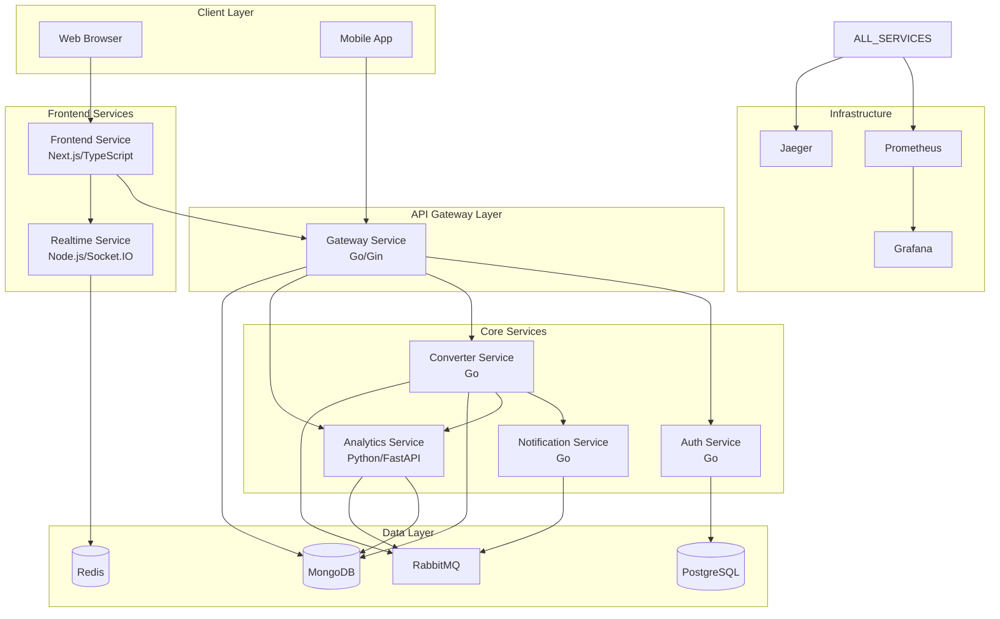

# Microservices Architecture Refactoring Design

## Overview

This design document outlines the complete refactoring of the existing Python-based video-to-MP3 conversion system into a modern, polyglot microservices architecture. The new system will leverage Go for high-performance backend services, TypeScript/Node.js for real-time communication and frontend, and Python for machine learning capabilities.

## Architecture

### Local Development with Tilt.dev

**Tilt.dev Integration:**

- **Unified Development Environment**: Single command to run all microservices locally
- **Live Reload**: Automatic rebuilds and restarts on code changes
- **Resource Management**: Orchestrates Docker builds, Kubernetes deployments, and port forwarding
- **Development Dashboard**: Web UI to monitor all services, logs, and resource status
- **Fast Iteration**: Optimized builds with caching and incremental updates

**Tiltfile Configuration:**

```python
# Tiltfile
load('ext://helm_resource', 'helm_resource', 'helm_repo')
load('ext://restart_process', 'docker_build_with_restart')

# Configure local Kubernetes cluster
allow_k8s_contexts('docker-desktop')

# Database services
helm_repo('bitnami', 'https://charts.bitnami.com/bitnami')
helm_resource('postgresql', 'bitnami/postgresql',
              flags=['--set', 'auth.postgresPassword=dev123'])
helm_resource('mongodb', 'bitnami/mongodb',
              flags=['--set', 'auth.rootPassword=dev123'])
helm_resource('redis', 'bitnami/redis',
              flags=['--set', 'auth.password=dev123'])
helm_resource('rabbitmq', 'bitnami/rabbitmq',
              flags=['--set', 'auth.username=admin', '--set', 'auth.password=dev123'])

# Go services with live reload
docker_build_with_restart(
    'gateway-service',
    context='./services/gateway',
    dockerfile='./services/gateway/Dockerfile.dev',
    entrypoint=['./gateway'],
    only=['./cmd', './internal', './go.mod', './go.sum'],
    live_update=[
        sync('./services/gateway', '/app'),
        run('go build -o gateway ./cmd/main.go', trigger=['**/*.go'])
    ]
)

docker_build_with_restart(
    'auth-service',
    context='./services/auth',
    dockerfile='./services/auth/Dockerfile.dev',
    entrypoint=['./auth'],
    only=['./cmd', './internal', './go.mod', './go.sum'],
    live_update=[
        sync('./services/auth', '/app'),
        run('go build -o auth ./cmd/main.go', trigger=['**/*.go'])
    ]
)

# TypeScript services with pnpm
docker_build(
    'frontend-service',
    context='./services/frontend',
    dockerfile='./services/frontend/Dockerfile.dev',
    live_update=[
        sync('./services/frontend/src', '/app/src'),
        sync('./services/frontend/package.json', '/app/package.json'),
        run('pnpm install', trigger=['package.json']),
        run('pnpm run build', trigger=['src/**/*'])
    ]
)

docker_build(
    'realtime-service',
    context='./services/realtime',
    dockerfile='./services/realtime/Dockerfile.dev',
    live_update=[
        sync('./services/realtime/src', '/app/src'),
        sync('./services/realtime/package.json', '/app/package.json'),
        run('pnpm install', trigger=['package.json']),
        run('pnpm run build', trigger=['src/**/*'])
    ]
)

# Python service with uv
docker_build(
    'analytics-service',
    context='./services/analytics',
    dockerfile='./services/analytics/Dockerfile.dev',
    live_update=[
        sync('./services/analytics/src', '/app/src'),
        sync('./services/analytics/pyproject.toml', '/app/pyproject.toml'),
        run('uv sync', trigger=['pyproject.toml']),
        restart_container()
    ]
)

# Kubernetes deployments
k8s_yaml(['k8s/gateway.yaml', 'k8s/auth.yaml', 'k8s/converter.yaml',
          'k8s/analytics.yaml', 'k8s/realtime.yaml', 'k8s/frontend.yaml'])

# Port forwards for local access
k8s_resource('gateway-service', port_forwards='8080:8080')
k8s_resource('frontend-service', port_forwards='3000:3000')
k8s_resource('realtime-service', port_forwards='3001:3001')
k8s_resource('analytics-service', port_forwards='8000:8000')

# Resource dependencies
k8s_resource('gateway-service', resource_deps=['postgresql', 'mongodb', 'redis'])
k8s_resource('auth-service', resource_deps=['postgresql'])
k8s_resource('converter-service', resource_deps=['mongodb', 'rabbitmq'])
k8s_resource('analytics-service', resource_deps=['mongodb', 'rabbitmq'])
k8s_resource('realtime-service', resource_deps=['redis'])
```

### High-Level Architecture Diagram



### Service Communication Patterns

1. **External → Internal**: REST/HTTP → gRPC
2. **Real-time Updates**: WebSocket + Redis Pub/Sub
3. **Async Processing**: RabbitMQ Message Queues
4. **Data Storage**: PostgreSQL (structured) + MongoDB (files) + Redis (cache)

## Components and Interfaces

### 1. Gateway Service (Go)

**Technology Stack:**

- Language: Go 1.21+
- Framework: Gin v1.9+
- Database: MongoDB (GridFS)
- Communication: gRPC client, REST server

**Key Responsibilities:**

- External API endpoints (REST)
- JWT token validation
- File upload handling
- Request routing to internal services
- Rate limiting and request throttling

**API Endpoints:**

```go
// REST API
POST   /api/v1/auth/login
POST   /api/v1/auth/register
POST   /api/v1/videos/upload
GET    /api/v1/videos/{id}/download
GET    /api/v1/videos/{id}/status
GET    /api/v1/videos/history
DELETE /api/v1/videos/{id}
```

**gRPC Client Interfaces:**

```protobuf
// auth.proto
service AuthService {
  rpc ValidateToken(TokenRequest) returns (TokenResponse);
  rpc GetUserInfo(UserRequest) returns (UserResponse);
}

// analytics.proto
service AnalyticsService {
  rpc AnalyzeVideo(VideoAnalysisRequest) returns (VideoAnalysisResponse);
  rpc GetRecommendations(RecommendationRequest) returns (RecommendationResponse);
}
```

### 2. Auth Service (Go)

**Technology Stack:**

- Language: Go 1.21+
- Framework: gRPC + Gin (for health checks)
- Database: PostgreSQL
- ORM: GORM v2
- Authentication: JWT + bcrypt

**Database Schema:**

```sql
CREATE TABLE users (
    id SERIAL PRIMARY KEY,
    email VARCHAR(255) UNIQUE NOT NULL,
    password_hash VARCHAR(255) NOT NULL,
    first_name VARCHAR(100),
    last_name VARCHAR(100),
    is_active BOOLEAN DEFAULT true,
    created_at TIMESTAMP DEFAULT NOW(),
    updated_at TIMESTAMP DEFAULT NOW()
);

CREATE TABLE user_sessions (
    id SERIAL PRIMARY KEY,
    user_id INTEGER REFERENCES users(id),
    token_hash VARCHAR(255) NOT NULL,
    expires_at TIMESTAMP NOT NULL,
    created_at TIMESTAMP DEFAULT NOW()
);
```

**gRPC Service Implementation:**

```go
type AuthServer struct {
    db *gorm.DB
    jwtSecret string
}

func (s *AuthServer) ValidateToken(ctx context.Context, req *pb.TokenRequest) (*pb.TokenResponse, error)
func (s *AuthServer) GetUserInfo(ctx context.Context, req *pb.UserRequest) (*pb.UserResponse, error)
func (s *AuthServer) RefreshToken(ctx context.Context, req *pb.RefreshRequest) (*pb.TokenResponse, error)
```

### 3. Converter Service (Go)

**Technology Stack:**

- Language: Go 1.21+
- Framework: gRPC server
- Message Queue: RabbitMQ (pika equivalent: amqp091-go)
- File Storage: MongoDB GridFS
- Video Processing: FFmpeg via exec.Command

**Concurrent Processing Design:**

```go
type ConverterService struct {
    workerPool chan struct{} // Limit concurrent conversions
    mongodb    *mongo.Client
    rabbitmq   *amqp.Connection
}

func (s *ConverterService) ProcessVideo(ctx context.Context, job *ConversionJob) error {
    select {
    case s.workerPool <- struct{}{}: // Acquire worker
        defer func() { <-s.workerPool }() // Release worker
        return s.convertVideo(ctx, job)
    case <-ctx.Done():
        return ctx.Err()
    }
}
```

**FFmpeg Integration:**

```go
func (s *ConverterService) convertVideoToMP3(inputPath, outputPath string) error {
    cmd := exec.Command("ffmpeg",
        "-i", inputPath,
        "-vn", // No video
        "-acodec", "libmp3lame",
        "-ab", "192k",
        "-ar", "44100",
        "-f", "mp3",
        outputPath)
    return cmd.Run()
}
```

### 4. Analytics Service (Python)

**Technology Stack:**

- Language: Python 3.11+
- Package Manager: uv 0.4+
- Framework: FastAPI
- ML Libraries: OpenCV, scikit-learn, TensorFlow/PyTorch
- Database: MongoDB
- Message Queue: RabbitMQ (pika)

**Key Features:**

1. **Video Metadata Extraction**
2. **Thumbnail Generation**
3. **Quality Analysis**
4. **Content Recommendations**
5. **Content Moderation**

**Service Implementation:**

```python
from fastapi import FastAPI
import cv2
import numpy as np
from sklearn.feature_extraction.text import TfidfVectorizer
from transformers import pipeline

class AnalyticsService:
    def __init__(self):
        self.content_classifier = pipeline("text-classification",
                                         model="unitary/toxic-bert")
        self.feature_extractor = TfidfVectorizer()

    async def analyze_video(self, video_path: str) -> VideoAnalysis:
        # Extract metadata
        metadata = self.extract_metadata(video_path)

        # Generate thumbnails
        thumbnails = self.generate_thumbnails(video_path)

        # Analyze quality
        quality_metrics = self.analyze_quality(video_path)

        # Content moderation
        safety_score = self.check_content_safety(video_path)

        return VideoAnalysis(
            metadata=metadata,
            thumbnails=thumbnails,
            quality=quality_metrics,
            safety_score=safety_score
        )
```

**ML Models Integration:**

```python
class VideoQualityAnalyzer:
    def analyze_quality(self, video_path: str) -> QualityMetrics:
        cap = cv2.VideoCapture(video_path)

        # Extract frames for analysis
        frames = []
        while cap.isOpened():
            ret, frame = cap.read()
            if not ret:
                break
            frames.append(frame)

        # Calculate quality metrics
        sharpness = self.calculate_sharpness(frames)
        brightness = self.calculate_brightness(frames)
        contrast = self.calculate_contrast(frames)

        return QualityMetrics(
            sharpness=sharpness,
            brightness=brightness,
            contrast=contrast,
            overall_score=self.calculate_overall_score(sharpness, brightness, contrast)
        )
```

### 5. Realtime Service (TypeScript/Node.js)

**Technology Stack:**

- Language: TypeScript 5.0+
- Runtime: Node.js 18+
- Package Manager: pnpm 8.0+
- Framework: Socket.IO
- Database: Redis
- Authentication: JWT validation

**WebSocket Server Implementation:**

```typescript
import { Server } from "socket.io";
import Redis from "ioredis";
import jwt from "jsonwebtoken";

class RealtimeService {
  private io: Server;
  private redis: Redis;
  private userConnections: Map<string, Set<string>> = new Map();

  constructor() {
    this.io = new Server({
      cors: { origin: "*" },
    });
    this.redis = new Redis(process.env.REDIS_URL);
    this.setupEventHandlers();
  }

  private setupEventHandlers() {
    this.io.use(this.authenticateSocket.bind(this));
    this.io.on("connection", this.handleConnection.bind(this));
    this.setupRedisSubscriptions();
  }

  private async authenticateSocket(socket: any, next: any) {
    try {
      const token = socket.handshake.auth.token;
      const decoded = jwt.verify(token, process.env.JWT_SECRET!) as any;
      socket.userId = decoded.userId;
      next();
    } catch (err) {
      next(new Error("Authentication failed"));
    }
  }

  private handleConnection(socket: any) {
    const userId = socket.userId;

    // Track user connections
    if (!this.userConnections.has(userId)) {
      this.userConnections.set(userId, new Set());
    }
    this.userConnections.get(userId)!.add(socket.id);

    // Join user-specific room
    socket.join(`user:${userId}`);

    socket.on("disconnect", () => {
      this.userConnections.get(userId)?.delete(socket.id);
    });
  }

  private setupRedisSubscriptions() {
    this.redis.subscribe(
      "conversion:progress",
      "conversion:complete",
      "conversion:error"
    );

    this.redis.on("message", (channel: string, message: string) => {
      const data = JSON.parse(message);

      switch (channel) {
        case "conversion:progress":
          this.io.to(`user:${data.userId}`).emit("progress", data);
          break;
        case "conversion:complete":
          this.io.to(`user:${data.userId}`).emit("complete", data);
          break;
        case "conversion:error":
          this.io.to(`user:${data.userId}`).emit("error", data);
          break;
      }
    });
  }
}
```

### 6. Frontend Service (Next.js/TypeScript)

**Technology Stack:**

- Framework: Next.js 14+ (App Router)
- Language: TypeScript 5.0+
- Package Manager: pnpm 8.0+
- Styling: Tailwind CSS
- State Management: Zustand
- WebSocket: Socket.IO Client
- HTTP Client: Axios

**Key Components:**

```typescript
// components/VideoUpload.tsx
import { useCallback, useState } from "react";
import { useDropzone } from "react-dropzone";
import { useSocket } from "../hooks/useSocket";

export const VideoUpload: React.FC = () => {
  const [uploadProgress, setUploadProgress] = useState(0);
  const [conversionProgress, setConversionProgress] = useState(0);
  const socket = useSocket();

  const onDrop = useCallback(
    async (acceptedFiles: File[]) => {
      const file = acceptedFiles[0];
      if (!file) return;

      // Upload file with progress
      const formData = new FormData();
      formData.append("video", file);

      try {
        const response = await axios.post("/api/v1/videos/upload", formData, {
          onUploadProgress: (progressEvent) => {
            const progress = Math.round(
              (progressEvent.loaded * 100) / progressEvent.total!
            );
            setUploadProgress(progress);
          },
        });

        // Listen for conversion progress
        socket?.on("progress", (data) => {
          setConversionProgress(data.progress);
        });
      } catch (error) {
        console.error("Upload failed:", error);
      }
    },
    [socket]
  );

  const { getRootProps, getInputProps, isDragActive } = useDropzone({
    onDrop,
    accept: {
      "video/*": [".mp4", ".avi", ".mov", ".mkv"],
    },
    maxFiles: 1,
  });

  return (
    <div
      {...getRootProps()}
      className="border-2 border-dashed border-gray-300 rounded-lg p-8"
    >
      <input {...getInputProps()} />
      {isDragActive ? (
        <p>Drop the video here...</p>
      ) : (
        <p>Drag & drop a video file here, or click to select</p>
      )}

      {uploadProgress > 0 && (
        <div className="mt-4">
          <div className="bg-blue-200 rounded-full h-2">
            <div
              className="bg-blue-600 h-2 rounded-full transition-all duration-300"
              style={{ width: `${uploadProgress}%` }}
            />
          </div>
          <p className="text-sm text-gray-600 mt-1">
            Upload: {uploadProgress}%
          </p>
        </div>
      )}

      {conversionProgress > 0 && (
        <div className="mt-4">
          <div className="bg-green-200 rounded-full h-2">
            <div
              className="bg-green-600 h-2 rounded-full transition-all duration-300"
              style={{ width: `${conversionProgress}%` }}
            />
          </div>
          <p className="text-sm text-gray-600 mt-1">
            Conversion: {conversionProgress}%
          </p>
        </div>
      )}
    </div>
  );
};
```

**Socket.IO Hook:**

```typescript
// hooks/useSocket.ts
import { useEffect, useState } from "react";
import { io, Socket } from "socket.io-client";
import { useAuthStore } from "../stores/authStore";

export const useSocket = () => {
  const [socket, setSocket] = useState<Socket | null>(null);
  const { token } = useAuthStore();

  useEffect(() => {
    if (!token) return;

    const newSocket = io(process.env.NEXT_PUBLIC_REALTIME_URL!, {
      auth: { token },
    });

    newSocket.on("connect", () => {
      console.log("Connected to realtime service");
    });

    newSocket.on("disconnect", () => {
      console.log("Disconnected from realtime service");
    });

    setSocket(newSocket);

    return () => {
      newSocket.close();
    };
  }, [token]);

  return socket;
};
```

## Data Models

### PostgreSQL Schema (Auth Service)

```sql
-- Users table
CREATE TABLE users (
    id SERIAL PRIMARY KEY,
    email VARCHAR(255) UNIQUE NOT NULL,
    password_hash VARCHAR(255) NOT NULL,
    first_name VARCHAR(100),
    last_name VARCHAR(100),
    is_active BOOLEAN DEFAULT true,
    created_at TIMESTAMP DEFAULT NOW(),
    updated_at TIMESTAMP DEFAULT NOW()
);

-- User sessions for JWT token tracking
CREATE TABLE user_sessions (
    id SERIAL PRIMARY KEY,
    user_id INTEGER REFERENCES users(id) ON DELETE CASCADE,
    token_hash VARCHAR(255) NOT NULL,
    expires_at TIMESTAMP NOT NULL,
    created_at TIMESTAMP DEFAULT NOW()
);

-- Indexes
CREATE INDEX idx_users_email ON users(email);
CREATE INDEX idx_sessions_user_id ON user_sessions(user_id);
CREATE INDEX idx_sessions_expires ON user_sessions(expires_at);
```

### MongoDB Collections

```javascript
// videos collection
{
  _id: ObjectId,
  userId: ObjectId,
  originalFilename: String,
  mimeType: String,
  size: Number,
  uploadedAt: Date,
  status: String, // 'uploaded', 'processing', 'completed', 'failed'
  conversionJobId: String,
  mp3FileId: ObjectId, // GridFS file ID
  metadata: {
    duration: Number,
    resolution: String,
    codec: String,
    bitrate: Number
  },
  analytics: {
    thumbnails: [String], // URLs to thumbnail images
    qualityScore: Number,
    safetyScore: Number,
    tags: [String]
  }
}

// conversion_jobs collection
{
  _id: ObjectId,
  videoId: ObjectId,
  userId: ObjectId,
  status: String, // 'pending', 'processing', 'completed', 'failed'
  progress: Number, // 0-100
  startedAt: Date,
  completedAt: Date,
  errorMessage: String,
  processingNode: String // Which converter instance handled this
}
```

### Redis Data Structures

```redis
# User sessions (Hash)
user:session:{userId} -> {
  "token": "jwt_token_hash",
  "expires": "timestamp",
  "lastActivity": "timestamp"
}

# Conversion progress (Hash)
conversion:{jobId} -> {
  "progress": "75",
  "status": "processing",
  "estimatedTime": "120"
}

# User activity cache (Sorted Set)
user:activity:{userId} -> {
  timestamp1: "uploaded_video",
  timestamp2: "started_conversion",
  timestamp3: "completed_conversion"
}

# Rate limiting (String with TTL)
rate_limit:{userId}:{endpoint} -> request_count (TTL: 3600)
```

## Error Handling

### gRPC Error Handling

```go
// Standard gRPC error codes
func (s *AuthServer) ValidateToken(ctx context.Context, req *pb.TokenRequest) (*pb.TokenResponse, error) {
    if req.Token == "" {
        return nil, status.Error(codes.InvalidArgument, "token is required")
    }

    claims, err := s.validateJWT(req.Token)
    if err != nil {
        return nil, status.Error(codes.Unauthenticated, "invalid token")
    }

    user, err := s.getUserByID(claims.UserID)
    if err != nil {
        if errors.Is(err, gorm.ErrRecordNotFound) {
            return nil, status.Error(codes.NotFound, "user not found")
        }
        return nil, status.Error(codes.Internal, "database error")
    }

    return &pb.TokenResponse{
        Valid: true,
        UserId: user.ID,
        Email: user.Email,
    }, nil
}
```

### HTTP Error Handling (Gateway)

```go
type ErrorResponse struct {
    Error   string `json:"error"`
    Code    string `json:"code"`
    Details string `json:"details,omitempty"`
}

func (h *Handler) handleError(c *gin.Context, err error) {
    var statusCode int
    var errorCode string

    switch {
    case errors.Is(err, ErrUnauthorized):
        statusCode = http.StatusUnauthorized
        errorCode = "UNAUTHORIZED"
    case errors.Is(err, ErrValidation):
        statusCode = http.StatusBadRequest
        errorCode = "VALIDATION_ERROR"
    case errors.Is(err, ErrNotFound):
        statusCode = http.StatusNotFound
        errorCode = "NOT_FOUND"
    default:
        statusCode = http.StatusInternalServerError
        errorCode = "INTERNAL_ERROR"
    }

    c.JSON(statusCode, ErrorResponse{
        Error:   err.Error(),
        Code:    errorCode,
        Details: getErrorDetails(err),
    })
}
```

## Testing Strategy

### Unit Testing

**Go Services:**

```go
// auth_service_test.go
func TestAuthService_ValidateToken(t *testing.T) {
    tests := []struct {
        name    string
        token   string
        want    *pb.TokenResponse
        wantErr bool
    }{
        {
            name:  "valid token",
            token: "valid_jwt_token",
            want: &pb.TokenResponse{
                Valid:  true,
                UserId: 1,
                Email:  "test@example.com",
            },
            wantErr: false,
        },
        {
            name:    "invalid token",
            token:   "invalid_token",
            want:    nil,
            wantErr: true,
        },
    }

    for _, tt := range tests {
        t.Run(tt.name, func(t *testing.T) {
            s := setupTestAuthService(t)
            got, err := s.ValidateToken(context.Background(), &pb.TokenRequest{
                Token: tt.token,
            })

            if (err != nil) != tt.wantErr {
                t.Errorf("ValidateToken() error = %v, wantErr %v", err, tt.wantErr)
                return
            }

            if !reflect.DeepEqual(got, tt.want) {
                t.Errorf("ValidateToken() = %v, want %v", got, tt.want)
            }
        })
    }
}
```

**TypeScript Services:**

```typescript
// realtime.service.test.ts
describe("RealtimeService", () => {
  let service: RealtimeService;
  let mockRedis: jest.Mocked<Redis>;

  beforeEach(() => {
    mockRedis = createMockRedis();
    service = new RealtimeService(mockRedis);
  });

  it("should authenticate socket with valid JWT", async () => {
    const mockSocket = createMockSocket();
    const validToken = jwt.sign({ userId: 1 }, process.env.JWT_SECRET!);

    mockSocket.handshake.auth.token = validToken;

    const next = jest.fn();
    await service.authenticateSocket(mockSocket, next);

    expect(mockSocket.userId).toBe(1);
    expect(next).toHaveBeenCalledWith();
  });

  it("should reject socket with invalid JWT", async () => {
    const mockSocket = createMockSocket();
    mockSocket.handshake.auth.token = "invalid_token";

    const next = jest.fn();
    await service.authenticateSocket(mockSocket, next);

    expect(next).toHaveBeenCalledWith(expect.any(Error));
  });
});
```

### Integration Testing

**API Integration Tests:**

```go
func TestVideoUploadFlow(t *testing.T) {
    // Setup test environment
    testDB := setupTestDatabase(t)
    testRedis := setupTestRedis(t)
    testRabbitMQ := setupTestRabbitMQ(t)

    // Start services
    authService := startAuthService(testDB)
    gatewayService := startGatewayService(authService, testRedis, testRabbitMQ)

    // Test flow
    t.Run("complete video upload and conversion flow", func(t *testing.T) {
        // 1. Register user
        user := registerTestUser(t, gatewayService)

        // 2. Login and get token
        token := loginUser(t, gatewayService, user.Email, user.Password)

        // 3. Upload video
        videoFile := createTestVideoFile(t)
        uploadResp := uploadVideo(t, gatewayService, token, videoFile)

        // 4. Verify video is queued for processing
        assert.Equal(t, "uploaded", uploadResp.Status)

        // 5. Wait for conversion to complete
        waitForConversion(t, uploadResp.VideoID, 30*time.Second)

        // 6. Download MP3
        mp3Data := downloadMP3(t, gatewayService, token, uploadResp.VideoID)
        assert.NotEmpty(t, mp3Data)
    })
}
```

### End-to-End Testing

**Frontend E2E Tests (Playwright):**

```typescript
// e2e/video-conversion.spec.ts
import { test, expect } from "@playwright/test";

test.describe("Video Conversion Flow", () => {
  test("should upload video and show conversion progress", async ({ page }) => {
    // Login
    await page.goto("/login");
    await page.fill("[data-testid=email]", "test@example.com");
    await page.fill("[data-testid=password]", "password123");
    await page.click("[data-testid=login-button]");

    // Navigate to upload page
    await page.goto("/upload");

    // Upload video file
    const fileInput = page.locator("[data-testid=file-input]");
    await fileInput.setInputFiles("test-video.mp4");

    // Wait for upload progress
    await expect(page.locator("[data-testid=upload-progress]")).toBeVisible();

    // Wait for conversion progress
    await expect(
      page.locator("[data-testid=conversion-progress]")
    ).toBeVisible();

    // Wait for completion
    await expect(page.locator("[data-testid=download-button]")).toBeVisible({
      timeout: 60000,
    });

    // Verify download works
    const downloadPromise = page.waitForDownload();
    await page.click("[data-testid=download-button]");
    const download = await downloadPromise;

    expect(download.suggestedFilename()).toMatch(/\.mp3$/);
  });
});
```

## Development Workflow

### Modern Package Management

**Python with uv:**

```toml
# pyproject.toml for Analytics Service
[project]
name = "analytics-service"
version = "0.1.0"
description = "ML-powered video analysis service"
requires-python = ">=3.11"
dependencies = [
    "fastapi>=0.104.0",
    "uvicorn>=0.24.0",
    "opencv-python>=4.8.0",
    "scikit-learn>=1.3.0",
    "transformers>=4.35.0",
    "motor>=3.3.0",
    "aio-pika>=9.3.0",
    "redis>=5.0.0"
]

[project.optional-dependencies]
dev = [
    "pytest>=7.4.0",
    "pytest-asyncio>=0.21.0",
    "ruff>=0.1.0",
    "mypy>=1.6.0"
]

[build-system]
requires = ["hatchling"]
build-backend = "hatchling.build"

[tool.ruff]
line-length = 88
target-version = "py311"

[tool.mypy]
python_version = "3.11"
strict = true
```

**TypeScript with pnpm:**

```json
// package.json (workspace root)
{
  "name": "video-converter-monorepo",
  "private": true,
  "workspaces": [
    "services/frontend",
    "services/realtime"
  ],
  "packageManager": "pnpm@8.10.0",
  "scripts": {
    "dev": "pnpm -r --parallel dev",
    "build": "pnpm -r build",
    "test": "pnpm -r test",
    "lint": "pnpm -r lint"
  },
  "devDependencies": {
    "@typescript-eslint/eslint-plugin": "^6.0.0",
    "@typescript-eslint/parser": "^6.0.0",
    "eslint": "^8.50.0",
    "prettier": "^3.0.0",
    "typescript": "^5.2.0"
  }
}

// services/frontend/package.json
{
  "name": "frontend-service",
  "version": "0.1.0",
  "scripts": {
    "dev": "next dev",
    "build": "next build",
    "start": "next start",
    "lint": "next lint"
  },
  "dependencies": {
    "next": "14.0.0",
    "react": "^18.2.0",
    "react-dom": "^18.2.0",
    "socket.io-client": "^4.7.0",
    "zustand": "^4.4.0",
    "tailwindcss": "^3.3.0"
  }
}
```

### Tilt.dev Development Commands

```bash
# Start all services with live reload
tilt up

# View Tilt dashboard
tilt up --web-mode=local  # Opens http://localhost:10350

# Restart specific service
tilt trigger gateway-service

# View logs for specific service
tilt logs auth-service

# Stop all services
tilt down
```

### Development Dockerfiles

**Go Service (Dockerfile.dev):**

```dockerfile
FROM golang:1.21-alpine AS dev

WORKDIR /app
RUN apk add --no-cache git

# Install air for live reload
RUN go install github.com/cosmtrek/air@latest

COPY go.mod go.sum ./
RUN go mod download

COPY . .
RUN go build -o main ./cmd/main.go

CMD ["air", "-c", ".air.toml"]
```

**TypeScript Service (Dockerfile.dev):**

```dockerfile
FROM node:18-alpine AS dev

# Install pnpm
RUN corepack enable && corepack prepare pnpm@8.10.0 --activate

WORKDIR /app

# Copy package files
COPY package.json pnpm-lock.yaml ./
RUN pnpm install --frozen-lockfile

COPY . .

EXPOSE 3000
CMD ["pnpm", "dev"]
```

**Python Service (Dockerfile.dev):**

```dockerfile
FROM python:3.11-slim AS dev

# Install uv
RUN pip install uv

WORKDIR /app

# Copy Python project files
COPY pyproject.toml uv.lock ./
RUN uv sync --dev

COPY . .

EXPOSE 8000
CMD ["uv", "run", "uvicorn", "src.main:app", "--host", "0.0.0.0", "--port", "8000", "--reload"]
```

### Local Development Setup

```bash
# 1. Clone repository
git clone <repo-url>
cd video-converter-microservices

# 2. Install development tools
# Install uv for Python
curl -LsSf https://astral.sh/uv/install.sh | sh

# Install pnpm for Node.js
npm install -g pnpm

# Install Tilt
curl -fsSL https://raw.githubusercontent.com/tilt-dev/tilt/master/scripts/install.sh | bash

# 3. Start local Kubernetes cluster (Docker Desktop or minikube)
# Docker Desktop: Enable Kubernetes in settings
# OR
minikube start

# 4. Start all services
tilt up

# 5. Access services
# Frontend: http://localhost:3000
# Gateway API: http://localhost:8080
# Realtime WebSocket: ws://localhost:3001
# Analytics API: http://localhost:8000
# Tilt Dashboard: http://localhost:10350
```

### Hot Reload Configuration

**Go Services (.air.toml):**

```toml
root = "."
testdata_dir = "testdata"
tmp_dir = "tmp"

[build]
  args_bin = []
  bin = "./tmp/main"
  cmd = "go build -o ./tmp/main ./cmd/main.go"
  delay = 1000
  exclude_dir = ["assets", "tmp", "vendor", "testdata"]
  exclude_file = []
  exclude_regex = ["_test.go"]
  exclude_unchanged = false
  follow_symlink = false
  full_bin = ""
  include_dir = []
  include_ext = ["go", "tpl", "tmpl", "html"]
  kill_delay = "0s"
  log = "build-errors.log"
  send_interrupt = false
  stop_on_root = false

[color]
  app = ""
  build = "yellow"
  main = "magenta"
  runner = "green"
  watcher = "cyan"

[log]
  time = false

[misc]
  clean_on_exit = false
```

**TypeScript Services (next.config.js):**

```javascript
/** @type {import('next').NextConfig} */
const nextConfig = {
  experimental: {
    appDir: true,
  },
  // Enable fast refresh in development
  reactStrictMode: true,
  // WebSocket proxy for development
  async rewrites() {
    return [
      {
        source: "/socket.io/:path*",
        destination: "http://realtime-service:3001/socket.io/:path*",
      },
    ];
  },
};

module.exports = nextConfig;
```

This comprehensive design covers all aspects of the refactored system, from the polyglot architecture to detailed implementation patterns, data models, error handling, testing strategies, and modern development workflow. The design ensures scalability, maintainability, and excellent developer experience while leveraging the strengths of each technology stack with cutting-edge tooling (uv, pnpm, Tilt.dev).
