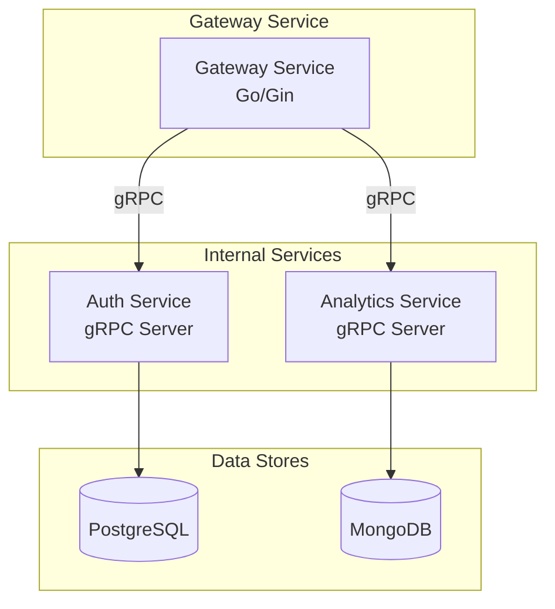

# gRPC Services Documentation

This document provides comprehensive documentation for all gRPC services in the Video Converter
microservices architecture.

## Overview

The system uses gRPC for internal service-to-service communication, providing type-safe,
high-performance communication between microservices. All gRPC services are defined using Protocol
Buffers (protobuf) and support both synchronous and streaming operations.

## Service Architecture



## Authentication Service (auth.proto)

The Authentication Service handles user authentication, authorization, and session management.

### Service Definition

```protobuf
service AuthService {
  rpc ValidateToken(TokenRequest) returns (TokenResponse);
  rpc GetUserInfo(UserRequest) returns (UserResponse);
  rpc RefreshToken(RefreshRequest) returns (TokenResponse);
  rpc RegisterUser(RegisterRequest) returns (RegisterResponse);
  rpc LoginUser(LoginRequest) returns (LoginResponse);
  rpc LogoutUser(LogoutRequest) returns (LogoutResponse);
}
```

### Methods

#### ValidateToken

Validates a JWT token and returns user information if valid.

**Request:**

```protobuf
message TokenRequest {
  string token = 1;  // JWT token to validate
}
```

**Response:**

```protobuf
message TokenResponse {
  bool valid = 1;           // Whether token is valid
  string user_id = 2;       // User ID if valid
  string email = 3;         // User email if valid
  common.Timestamp expires_at = 4;  // Token expiration time
}
```

**Usage Example (Go):**

```go
client := auth.NewAuthServiceClient(conn)
resp, err := client.ValidateToken(ctx, &auth.TokenRequest{
    Token: "eyJhbGciOiJIUzI1NiIsInR5cCI6IkpXVCJ9...",
})
if err != nil {
    return err
}
if !resp.Valid {
    return errors.New("invalid token")
}
```

#### GetUserInfo

Retrieves user information by user ID.

**Request:**

```protobuf
message UserRequest {
  string user_id = 1;  // User ID to lookup
}
```

**Response:**

```protobuf
message UserResponse {
  string user_id = 1;
  string email = 2;
  string first_name = 3;
  string last_name = 4;
  bool is_active = 5;
  common.Timestamp created_at = 6;
}
```

#### RefreshToken

Generates a new JWT token using a refresh token.

**Request:**

```protobuf
message RefreshRequest {
  string refresh_token = 1;  // Refresh token
}
```

**Response:**

```protobuf
message TokenResponse {
  bool valid = 1;
  string user_id = 2;
  string email = 3;
  common.Timestamp expires_at = 4;
}
```

#### RegisterUser

Registers a new user account.

**Request:**

```protobuf
message RegisterRequest {
  string email = 1;
  string password = 2;
  string first_name = 3;
  string last_name = 4;
}
```

**Response:**

```protobuf
message RegisterResponse {
  bool success = 1;
  string user_id = 2;
  string message = 3;
  common.Error error = 4;
}
```

#### LoginUser

Authenticates user credentials and returns tokens.

**Request:**

```protobuf
message LoginRequest {
  string email = 1;
  string password = 2;
}
```

**Response:**

```protobuf
message LoginResponse {
  bool success = 1;
  string access_token = 2;
  string refresh_token = 3;
  UserResponse user = 4;
  common.Error error = 5;
}
```

#### LogoutUser

Invalidates user tokens and logs out the user.

**Request:**

```protobuf
message LogoutRequest {
  string refresh_token = 1;
  string access_token = 2;  // Optional, for blacklisting
}
```

**Response:**

```protobuf
message LogoutResponse {
  bool success = 1;
  string message = 2;
  common.Error error = 3;
}
```

## Analytics Service (analytics.proto)

The Analytics Service provides ML-powered video analysis, quality assessment, and recommendation
capabilities.

### Service Definition

```protobuf
service AnalyticsService {
  rpc AnalyzeVideo(VideoAnalysisRequest) returns (VideoAnalysisResponse);
  rpc GetQualityMetrics(QualityRequest) returns (QualityResponse);
  rpc GetRecommendations(RecommendationRequest) returns (RecommendationResponse);
  rpc CheckContentSafety(SafetyRequest) returns (SafetyResponse);
  rpc GenerateThumbnails(ThumbnailRequest) returns (ThumbnailResponse);
}
```

### Methods

#### AnalyzeVideo

Performs comprehensive video analysis including quality metrics, thumbnails, and content tagging.

**Request:**

```protobuf
message VideoAnalysisRequest {
  string video_id = 1;
  string user_id = 2;
  string video_path = 3;
  common.VideoMetadata metadata = 4;
}
```

**Response:**

```protobuf
message VideoAnalysisResponse {
  string video_id = 1;
  QualityMetrics quality = 2;
  repeated string thumbnails = 3;
  repeated string tags = 4;
  SafetyScore safety = 5;
  common.Error error = 6;
}
```

**Usage Example (Go):**

```go
client := analytics.NewAnalyticsServiceClient(conn)
resp, err := client.AnalyzeVideo(ctx, &analytics.VideoAnalysisRequest{
    VideoId:   "507f1f77bcf86cd799439011",
    UserId:    "507f1f77bcf86cd799439012",
    VideoPath: "/tmp/video.mp4",
    Metadata: &common.VideoMetadata{
        Filename:        "video.mp4",
        SizeBytes:       52428800,
        DurationSeconds: 180,
        Resolution:      "1920x1080",
        Codec:          "h264",
        Bitrate:        2500000,
        Format:         common.VideoFormat_VIDEO_FORMAT_MP4,
    },
})
```

#### GetQualityMetrics

Analyzes video quality and returns detailed metrics.

**Request:**

```protobuf
message QualityRequest {
  string video_id = 1;
  string video_path = 2;
}
```

**Response:**

```protobuf
message QualityResponse {
  QualityMetrics quality = 1;
  common.Error error = 2;
}

message QualityMetrics {
  float sharpness_score = 1;      // 0.0 to 100.0
  float brightness_score = 2;     // 0.0 to 100.0
  float contrast_score = 3;       // 0.0 to 100.0
  float overall_score = 4;        // 0.0 to 100.0
  string resolution_category = 5; // "low", "medium", "high", "ultra"
}
```

#### GetRecommendations

Provides personalized video recommendations based on user preferences and content similarity.

**Request:**

```protobuf
message RecommendationRequest {
  string user_id = 1;
  int32 limit = 2;
  repeated string exclude_video_ids = 3;
}
```

**Response:**

```protobuf
message RecommendationResponse {
  repeated VideoRecommendation recommendations = 1;
  common.Error error = 2;
}

message VideoRecommendation {
  string video_id = 1;
  string title = 2;
  float similarity_score = 3;
  repeated string tags = 4;
  string thumbnail_url = 5;
}
```

#### CheckContentSafety

Analyzes video content for safety and moderation purposes.

**Request:**

```protobuf
message SafetyRequest {
  string video_id = 1;
  string video_path = 2;
}
```

**Response:**

```protobuf
message SafetyResponse {
  SafetyScore safety = 1;
  common.Error error = 2;
}

message SafetyScore {
  float overall_score = 1;        // 0.0 (unsafe) to 1.0 (safe)
  bool is_safe = 2;
  repeated SafetyFlag flags = 3;
}

message SafetyFlag {
  string category = 1;    // "violence", "adult", "hate", etc.
  float confidence = 2;   // 0.0 to 1.0
  string description = 3;
}
```

#### GenerateThumbnails

Generates thumbnail images from video at specified timestamps.

**Request:**

```protobuf
message ThumbnailRequest {
  string video_id = 1;
  string video_path = 2;
  repeated int32 timestamp_seconds = 3; // Specific timestamps
  int32 count = 4;                      // Auto-generate count if timestamps not specified
}
```

**Response:**

```protobuf
message ThumbnailResponse {
  repeated Thumbnail thumbnails = 1;
  common.Error error = 2;
}

message Thumbnail {
  string url = 1;
  int32 timestamp_seconds = 2;
  int32 width = 3;
  int32 height = 4;
}
```

## Common Types (common.proto)

Shared message types and enums used across all services.

### Enums

```protobuf
enum Status {
  STATUS_UNSPECIFIED = 0;
  STATUS_PENDING = 1;
  STATUS_PROCESSING = 2;
  STATUS_COMPLETED = 3;
  STATUS_FAILED = 4;
}

enum VideoFormat {
  VIDEO_FORMAT_UNSPECIFIED = 0;
  VIDEO_FORMAT_MP4 = 1;
  VIDEO_FORMAT_AVI = 2;
  VIDEO_FORMAT_MOV = 3;
  VIDEO_FORMAT_MKV = 4;
  VIDEO_FORMAT_WEBM = 5;
}

enum AudioFormat {
  AUDIO_FORMAT_UNSPECIFIED = 0;
  AUDIO_FORMAT_MP3 = 1;
  AUDIO_FORMAT_WAV = 2;
  AUDIO_FORMAT_AAC = 3;
  AUDIO_FORMAT_FLAC = 4;
}
```

### Common Messages

```protobuf
message VideoMetadata {
  string filename = 1;
  int64 size_bytes = 2;
  int32 duration_seconds = 3;
  string resolution = 4;
  string codec = 5;
  int32 bitrate = 6;
  VideoFormat format = 7;
}

message ConversionJob {
  string job_id = 1;
  string user_id = 2;
  string video_id = 3;
  VideoMetadata video_metadata = 4;
  AudioFormat target_format = 5;
  Status status = 6;
  int32 progress_percent = 7;
  Timestamp created_at = 8;
  Timestamp updated_at = 9;
  Error error = 10;
}

message Error {
  string code = 1;
  string message = 2;
  string details = 3;
}
```

## Client Implementation Examples

### Go Client

```go
package main

import (
    "context"
    "log"

    "google.golang.org/grpc"
    "google.golang.org/grpc/credentials/insecure"

    "github.com/video-converter/shared/proto/gen/go/auth"
    "github.com/video-converter/shared/proto/gen/go/analytics"
)

func main() {
    // Connect to Auth Service
    authConn, err := grpc.Dial("auth-service:50051", grpc.WithTransportCredentials(insecure.NewCredentials()))
    if err != nil {
        log.Fatal(err)
    }
    defer authConn.Close()

    authClient := auth.NewAuthServiceClient(authConn)

    // Validate token
    tokenResp, err := authClient.ValidateToken(context.Background(), &auth.TokenRequest{
        Token: "your-jwt-token",
    })
    if err != nil {
        log.Fatal(err)
    }

    if tokenResp.Valid {
        log.Printf("Token valid for user: %s", tokenResp.Email)
    }

    // Connect to Analytics Service
    analyticsConn, err := grpc.Dial("analytics-service:50052", grpc.WithTransportCredentials(insecure.NewCredentials()))
    if err != nil {
        log.Fatal(err)
    }
    defer analyticsConn.Close()

    analyticsClient := analytics.NewAnalyticsServiceClient(analyticsConn)

    // Get recommendations
    recResp, err := analyticsClient.GetRecommendations(context.Background(), &analytics.RecommendationRequest{
        UserId: tokenResp.UserId,
        Limit:  10,
    })
    if err != nil {
        log.Fatal(err)
    }

    for _, rec := range recResp.Recommendations {
        log.Printf("Recommendation: %s (score: %.2f)", rec.Title, rec.SimilarityScore)
    }
}
```

### TypeScript Client

```typescript
import * as grpc from '@grpc/grpc-js';
import * as protoLoader from '@grpc/proto-loader';

// Load proto definitions
const authPackageDefinition = protoLoader.loadSync('shared/proto/auth.proto', {
  keepCase: true,
  longs: String,
  enums: String,
  defaults: true,
  oneofs: true,
});

const authProto = grpc.loadPackageDefinition(authPackageDefinition) as any;

// Create client
const authClient = new authProto.auth.AuthService(
  'auth-service:50051',
  grpc.credentials.createInsecure()
);

// Validate token
authClient.ValidateToken({ token: 'your-jwt-token' }, (error: any, response: any) => {
  if (error) {
    console.error('Error:', error);
    return;
  }

  if (response.valid) {
    console.log(`Token valid for user: ${response.email}`);
  }
});
```

### Python Client

```python
import grpc
from shared.proto.gen.python import auth_pb2, auth_pb2_grpc
from shared.proto.gen.python import analytics_pb2, analytics_pb2_grpc

# Create channel and client
channel = grpc.insecure_channel('auth-service:50051')
auth_client = auth_pb2_grpc.AuthServiceStub(channel)

# Validate token
request = auth_pb2.TokenRequest(token='your-jwt-token')
response = auth_client.ValidateToken(request)

if response.valid:
    print(f"Token valid for user: {response.email}")

# Analytics client
analytics_channel = grpc.insecure_channel('analytics-service:50052')
analytics_client = analytics_pb2_grpc.AnalyticsServiceStub(analytics_channel)

# Get recommendations
rec_request = analytics_pb2.RecommendationRequest(
    user_id=response.user_id,
    limit=10
)
rec_response = analytics_client.GetRecommendations(rec_request)

for rec in rec_response.recommendations:
    print(f"Recommendation: {rec.title} (score: {rec.similarity_score})")
```

## Error Handling

All gRPC services use standard gRPC status codes and include detailed error information in the
`common.Error` message type:

```protobuf
message Error {
  string code = 1;      // Application-specific error code
  string message = 2;   // Human-readable error message
  string details = 3;   // Additional error details
}
```

### Common Error Codes

| Code                | Description                     | gRPC Status          |
| ------------------- | ------------------------------- | -------------------- |
| `INVALID_TOKEN`     | JWT token is invalid or expired | `UNAUTHENTICATED`    |
| `USER_NOT_FOUND`    | User does not exist             | `NOT_FOUND`          |
| `VALIDATION_ERROR`  | Request validation failed       | `INVALID_ARGUMENT`   |
| `INTERNAL_ERROR`    | Internal server error           | `INTERNAL`           |
| `PERMISSION_DENIED` | User lacks required permissions | `PERMISSION_DENIED`  |
| `RATE_LIMITED`      | Request rate limit exceeded     | `RESOURCE_EXHAUSTED` |

## Performance Considerations

### Connection Pooling

Use connection pooling for gRPC clients to improve performance:

```go
// Go example with connection pooling
pool := &sync.Pool{
    New: func() interface{} {
        conn, _ := grpc.Dial("auth-service:50051", grpc.WithTransportCredentials(insecure.NewCredentials()))
        return auth.NewAuthServiceClient(conn)
    },
}

client := pool.Get().(auth.AuthServiceClient)
defer pool.Put(client)
```

### Timeouts and Retries

Always set appropriate timeouts and implement retry logic:

```go
ctx, cancel := context.WithTimeout(context.Background(), 5*time.Second)
defer cancel()

resp, err := client.ValidateToken(ctx, req)
```

### Load Balancing

Configure client-side load balancing for high availability:

```go
conn, err := grpc.Dial(
    "dns:///auth-service:50051",
    grpc.WithDefaultServiceConfig(`{"loadBalancingPolicy":"round_robin"}`),
    grpc.WithTransportCredentials(insecure.NewCredentials()),
)
```

## Security

### TLS Configuration

In production, always use TLS for gRPC communication:

```go
creds, err := credentials.NewClientTLSFromFile("server.crt", "")
if err != nil {
    log.Fatal(err)
}

conn, err := grpc.Dial("auth-service:50051", grpc.WithTransportCredentials(creds))
```

### Authentication

Services should validate client certificates or use token-based authentication:

```go
// Server-side authentication interceptor
func authInterceptor(ctx context.Context, req interface{}, info *grpc.UnaryServerInfo, handler grpc.UnaryHandler) (interface{}, error) {
    // Extract and validate authentication token
    token := extractToken(ctx)
    if !validateToken(token) {
        return nil, status.Error(codes.Unauthenticated, "invalid token")
    }

    return handler(ctx, req)
}
```
